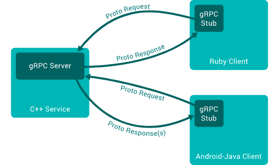
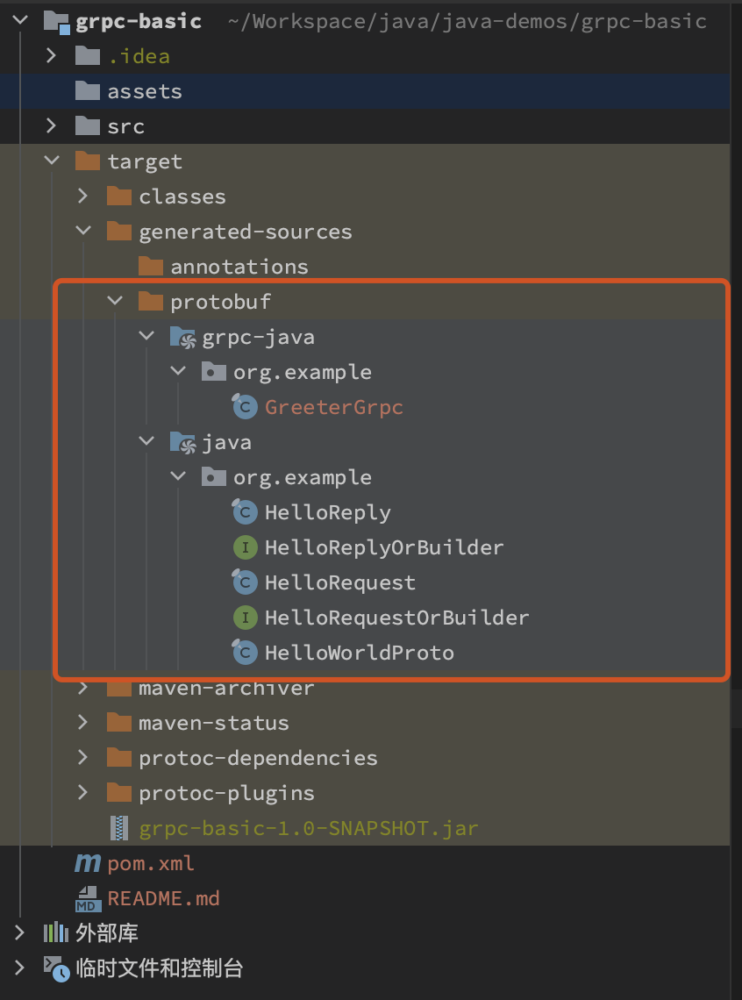
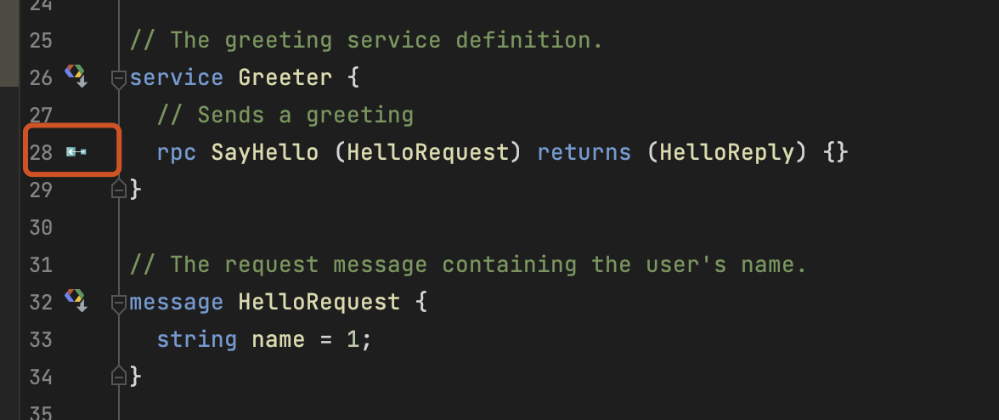
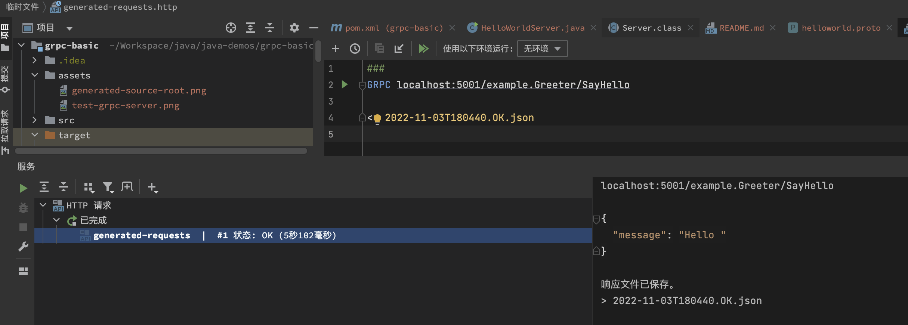

# gRPC basic

gRPC是Google开源的RPC框架，其使用[Protocol Buffer](https://developers.google.com/protocol-buffers/docs/overview)作为二进制协议来序列化数据

## Overview


## 配置

### 基本依赖
首先需要添加Maven依赖，指定grpc和protobuf的版本：

```xml
<project>
    <properties>
        <grpc.version>1.50.2</grpc.version>
        <protobuf.version>3.21.7</protobuf.version>
        <project.build.sourceEncoding>UTF-8</project.build.sourceEncoding>
        <maven.compiler.source>1.7</maven.compiler.source>
        <maven.compiler.target>1.7</maven.compiler.target>
    </properties>
    
    <!-- https://github.com/grpc/grpc-java/blob/master/README.md -->
    <dependencies>
        <dependency>
            <groupId>io.grpc</groupId>
            <artifactId>grpc-netty-shaded</artifactId>
            <version>${grpc.version}</version>
            <scope>runtime</scope>
        </dependency>
        <dependency>
            <groupId>io.grpc</groupId>
            <artifactId>grpc-protobuf</artifactId>
            <version>${grpc.version}</version>
        </dependency>
        <dependency>
            <groupId>io.grpc</groupId>
            <artifactId>grpc-stub</artifactId>
            <version>${grpc.version}</version>
        </dependency>
        <dependency> <!-- necessary for Java 9+ -->
            <groupId>org.apache.tomcat</groupId>
            <artifactId>annotations-api</artifactId>
            <version>6.0.53</version>
            <scope>provided</scope>
        </dependency>
    </dependencies>
</project>
```

### proto文件编写
指定好依赖后还需要在`src/main/proto`和（或）`src/test/proto`创建`.proto`文件

#### 定义message
服务间通信使用的请求和响应数据都通过`message`定义：
```protobuf
// see https://developers.google.com/protocol-buffers/docs/proto3
syntax = "proto3";

message SearchRequest {
  string query = 1;
  int32 page_number = 2;
  int32 result_per_page = 3;
}
```

message中的每个field都需要有一个唯一且不可变的数字与之对应（最小值为1），以用作标识。

由于1到15的数字编码后占用1字节而16到2047将会占用2字节，所以尽量只使用1到15的数字以减小消息体积。

#### 定义service

service通过`service`关键字定义，service的名字将会影响生成代码中的类的名字，例如`SearchService`将会生成`SearchServiceGrpc.SearchServiceImplBase`。
service将包含若干条`rpc`语句，表示对应方法的签名。服务端需要逐一实现这些定义的方法。
```protobuf
syntax = "proto3";

message SearchRequest {
  string query = 1;
  int32 page_number = 2;
  int32 result_per_page = 3;
}

message SearchResponse {
  int32 total_count = 1;
}

service SearchService {
  rpc Search(SearchRequest) returns (SearchResponse);
}
```

#### 语言相关配置

proto文件中除了语言无关的部分外，还有一些语言相关的配置，以相应前缀标识。
对java来说最重要的配置是`java_package`，用于指定生成代码所属的包。其他参数及作用可参考[官方文档](https://developers.google.com/protocol-buffers/docs/proto3#options)。
```protobuf
option java_multiple_files = true;
option java_package = "org.example";
option java_outer_classname = "HelloWorldProto";
```

### 根据proto文件生成代码

proto文件通过语言无关的IDL(Interface Description Language)描述了服务的接口。想要在Java项目中使用还需要通过proto文件生成对应的java代码。

可以通过以下命令生成代码，不过更方便的是使用对应构建系统的插件。
```shell
protoc --plugin=protoc-gen-grpc-java \
    --grpc-java_out="$OUTPUT_FILE" --proto_path="$DIR_OF_PROTO_FILE" "$PROTO_FILE"
```

#### Maven
使用maven的项目可以用[protobuf-maven-plugin](https://www.xolstice.org/protobuf-maven-plugin/)来生成代码。

> Tips: 如果Maven提示找不到插件，则需要到Maven设置中把「使用插件注册表(Use plugin registry)」勾选上

```xml
<build>
  <extensions>
    <extension>
      <groupId>kr.motd.maven</groupId>
      <artifactId>os-maven-plugin</artifactId>
      <version>1.6.2</version>
    </extension>
  </extensions>
  <plugins>
    <plugin>
      <groupId>org.xolstice.maven.plugins</groupId>
      <artifactId>protobuf-maven-plugin</artifactId>
      <version>0.5.0</version>
        <configuration>
            <protocArtifact>com.google.protobuf:protoc:${protobuf.version}:exe:${os.detected.classifier}</protocArtifact>
            <pluginId>grpc-java</pluginId>
            <pluginArtifact>io.grpc:protoc-gen-grpc-java:${grpc.version}:exe:${os.detected.classifier}</pluginArtifact>
        </configuration>
      <executions>
        <execution>
          <goals>
            <goal>compile</goal>
            <goal>compile-custom</goal>
          </goals>
        </execution>
      </executions>
    </plugin>
  </plugins>
</build>
```

#### Bazel

使用bazel的项目可以用[java_grpc_library](https://github.com/grpc/grpc-java/blob/master/java_grpc_library.bzl)来生成代码

> 还没试过，记录以供后续参考
```
load("@grpc_java//:java_grpc_library.bzl", "java_grpc_library")

proto_library(
    name = "helloworld_proto",
    srcs = ["src/main/proto/helloworld.proto"],
)

java_proto_library(
    name = "helloworld_java_proto",
    deps = [":helloworld_proto"],
)

java_grpc_library(
    name = "helloworld_java_grpc",
    srcs = [":helloworld_proto"],
    deps = [":helloworld_java_proto"],
)
```

### gRPC服务端

#### 服务端实现及启动
> Tips: 若发现找不到生成代码中对应的grpc类，需要将生成代码所在目录标记为「生成的源代码根目录」，如图所示（注意图标）：

服务端需要通过ServerBuilder来配置和启动服务：
```
server = ServerBuilder.forPort(port)
        .addService(new GreeterImpl())
        .build()
        .start();
```

其中的`GreeterImpl`是服务的具体实现，需要继承生成的`GreeterGrpc.GreeterImplBase`（具体需与proto文件内容对应）并实现指定的方法

以`sayHello(HelloRequest req, StreamObserver<HelloReply> responseObserver)`方法为例，`req`是指客户端发来的`HelloRequest`请求，`responseObserver`则是响应流，用于将构造好的`HelloReply`返回给客户端。函数签名类型与proto文件中的rpc签名一致。
```
HelloReply reply = HelloReply.newBuilder().setMessage("Hello from server, " + req.getName()).build();
responseObserver.onNext(reply);
responseObserver.onCompleted();
```

直接启动服务会发现代码执行成功后进程自动退出，作为server我们希望能够一直运行直到手动关闭服务，所以在启动后需要使用`awaitTermination()`来等待`server.shutdown()`被调用
```
private void blockUntilShutdown() throws InterruptedException {
    if (server != null) {
        server.awaitTermination();
    }
}
```

服务启动后可以发送gRPC请求来进行测试。点击proto文件中rpc方法前的按钮可以打开测试工具，执行后将得到对应的响应：



#### 停止服务

服务的停止需要通过`server.shutdown()`来进行，以完成进行中的任务、停止线程、释放各种资源。

```
private void stop() throws InterruptedException {
    if (server != null) {
        server.shutdown().awaitTermination(30, TimeUnit.SECONDS);
    }
}

```

服务端将长时间运行，一般在手动ctrl-C结束进程时调用，详见[`Runtime.getRuntime().addShutdownHook()`部分](https://github.com/grpc/grpc-java/blob/v1.50.2/examples/src/main/java/io/grpc/examples/helloworld/HelloWorldServer.java#L48)。

### gRPC客户端

#### 客户端实现

客户端想要和服务端通信分为以下几步：
1. 创建和服务端通信用的Channel
2. 创建stub
3. 通过stub执行rpc调用

Channel的创建需要指定target作为rpc请求发生的目标，即服务端地址：
```
 ManagedChannel channel = ManagedChannelBuilder.forTarget(target)
    // Channels are secure by default (via SSL/TLS). For the example we disable TLS to avoid
    // needing certificates.
    .usePlaintext()
    .build();
```

然后就可以用这个`channel`来创建`stub`，`stub`分为阻塞和非阻塞两种，分别使用`GreeterGrpc.newBlockingStub(channel)`和`GreeterGrpc.newStub(channel)`创建

```
public HelloWorldClient(Channel channel) {
    // 'channel' here is a Channel, not a ManagedChannel, so it is not this code's responsibility to
    // shut it down.

    // Passing Channels to code makes code easier to test and makes it easier to reuse Channels.
    blockingStub = GreeterGrpc.newBlockingStub(channel);
}
```

然后就可以通过创建的`stub`发起rpc调用：
```
public void sayHelloToServer(String name) {
    logger.info("Will try to greet " + name + " ...");
    HelloRequest req = HelloRequest.newBuilder().setName(name).build();

    HelloReply response = blockingStub.sayHello(req);

    logger.info("Response from server: " +  response.getMessage());
}
```

#### 停止客户端

与服务端相同，在调用结束后需要显示调用停止来释放资源，区别在于是使用Channel上的方法
```
  channel.shutdownNow().awaitTermination(5, TimeUnit.SECONDS);
```

## References

- [官方grpc-java README](https://github.com/grpc/grpc-java/blob/master/README.md)
- [Protocol Buffers文档](https://developers.google.com/protocol-buffers/docs/proto3)